# Laboratório Active Directory — Suporte N1

Projeto prático desenvolvido para simular rotinas comuns de **Suporte Técnico N1** em um ambiente de domínio Windows, utilizando **Active Directory Domain Services (AD DS)**.

O laboratório foi criado com foco em atividades encontradas no dia a dia de Help Desk e Service Desk, como gerenciamento de usuários, grupos e permissões, redefinição de senha, desbloqueio e desabilitação de contas, onboarding de colaboradores e validação de acesso a recursos compartilhados.

> **Observação:** todos os usuários, nomes e informações apresentados neste projeto são fictícios e foram criados exclusivamente para fins de estudo.

**Tecnologias e conceitos:** Windows Server • Active Directory • AD DS • Active Directory Users and Computers • Group Policy • NTFS • Compartilhamento de arquivos • Hyper-V • Windows Client • Suporte N1

## 🎯 Objetivo

Consolidar conhecimentos de Active Directory aplicados à rotina de suporte técnico, praticando a administração básica de identidades e acessos em um cenário corporativo simulado.

## 🖥️ Ambiente do laboratório

- Domínio: `lab.test`
- Controlador de domínio: `SRV-DC01`
- Estação cliente: `CLIENTE01`
- OUs de usuários: `Financeiro` e `RH`
- Grupo de segurança: `GG_Financeiro`
- Compartilhamento: `\\SRV-DC01\Financeiro`
- Usuários fictícios utilizados nos testes: Cecília Luiza, Rafael Martins e Lucas Almeida

## 🔧 Cenários praticados

- Criação e organização de OUs
- Autenticação de usuário em uma estação do domínio
- Validação do controlador de domínio utilizado no logon
- Criação e utilização de grupos de segurança
- Configuração de permissões NTFS por grupo
- Validação de leitura e gravação em pasta compartilhada
- Revogação de acesso a recurso do setor
- Redefinição de senha de usuário
- Troca obrigatória de senha no primeiro logon
- Configuração e teste de bloqueio de conta
- Desbloqueio de usuário pelo Active Directory
- Teste de conta desabilitada
- Onboarding de novo colaborador
- Concessão de acesso por associação a grupo
- Validação do princípio do menor privilégio
- Documentação de procedimentos e resultados dos testes

# 📸 Demonstração

## 1. Configuração do domínio

Domínio `lab.test` configurado no Active Directory Domain Services para utilização no laboratório.

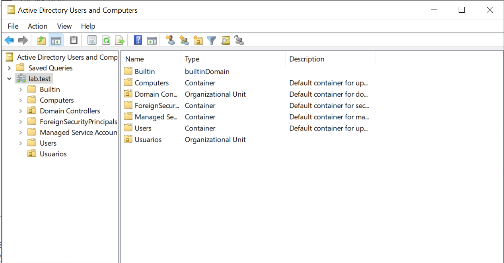

## 2. Organização por unidades organizacionais

Estrutura de OUs criada para organizar usuários dos setores Financeiro e RH.

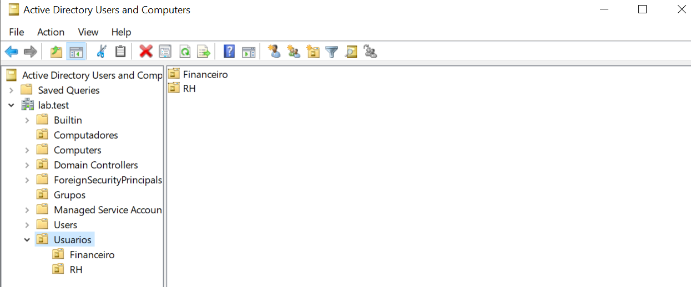

## 3. Validação da estação no domínio

Validação da conta autenticada, do controlador de domínio `SRV-DC01` e da estação `CLIENTE01` utilizando os comandos `whoami`, `%logonserver%` e `hostname`.

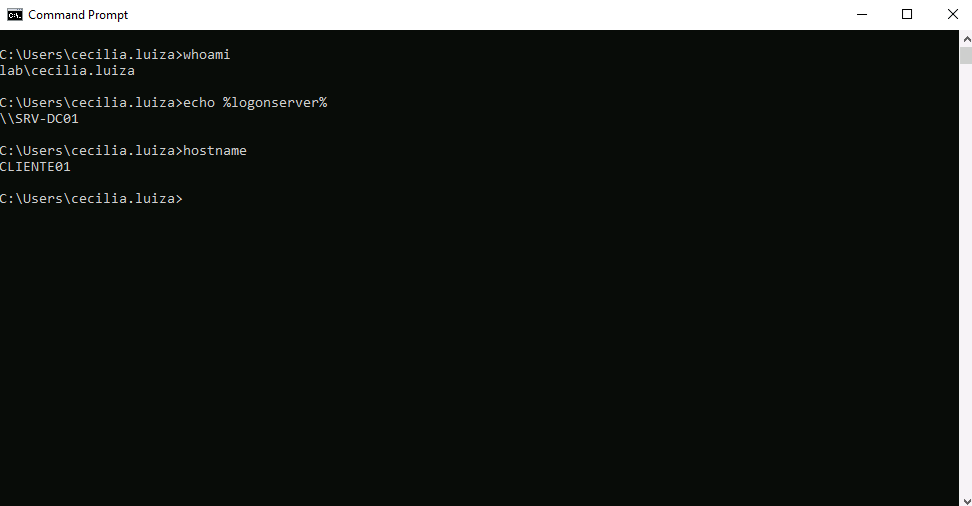

## 4. Permissões da pasta Financeiro

O grupo `GG_Financeiro` foi configurado com permissão **Modify** sobre a pasta compartilhada do setor, permitindo leitura, criação e alteração de arquivos pelos membros autorizados.

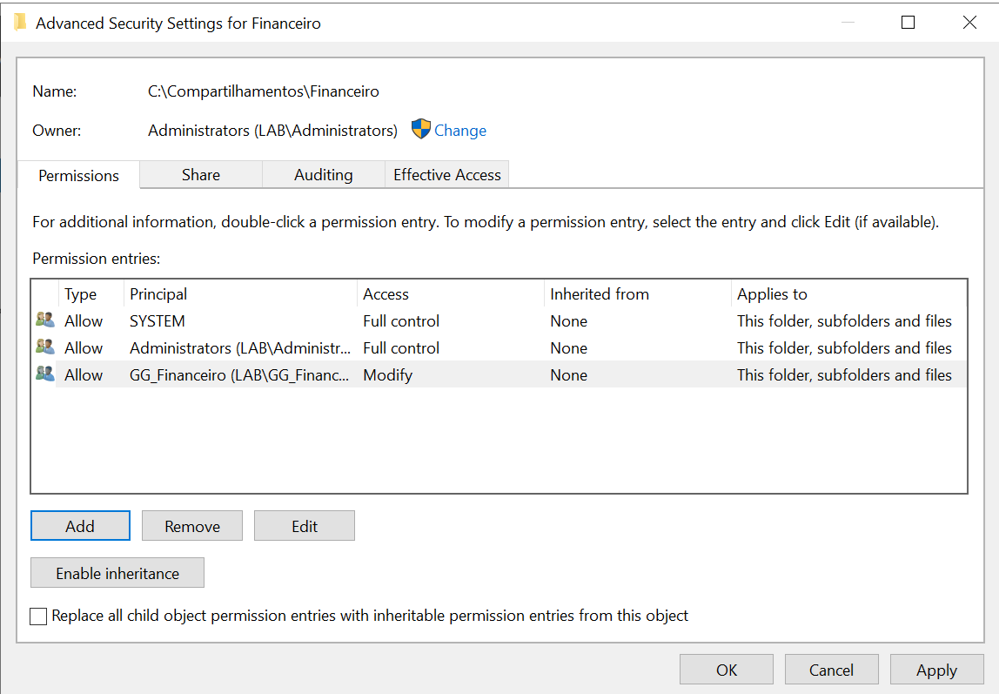

## 5. Validação do grupo de segurança

O comando `whoami /groups` foi utilizado para confirmar que a sessão da usuária Cecília recebeu o grupo `GG_Financeiro` em seu token de segurança.

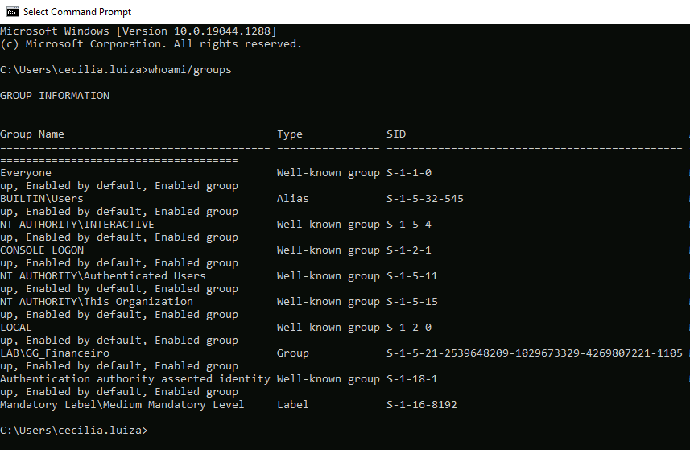

## 6. Validação de leitura e gravação

A usuária Cecília criou o arquivo `Teste_Cecilia` em `\\SRV-DC01\Financeiro`, confirmando a aplicação das permissões de acesso e gravação.

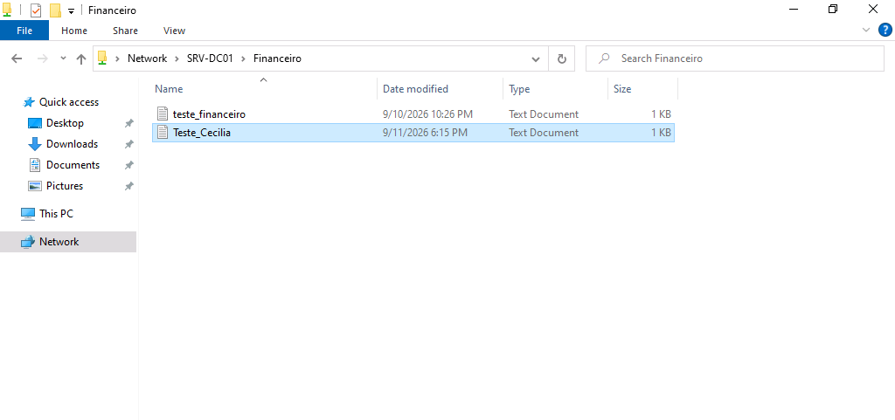

## 7. Revogação de acesso

Após a remoção da permissão de acesso ao Financeiro e a atualização da sessão da usuária, o compartilhamento passou a retornar **acesso negado**.

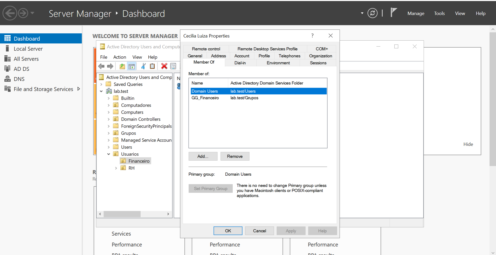

# 🔐 Gestão de contas e credenciais

## 8. Redefinição de senha

Foi realizada a redefinição da senha da usuária pelo Active Directory, utilizando uma credencial temporária sem exposição da senha na documentação.

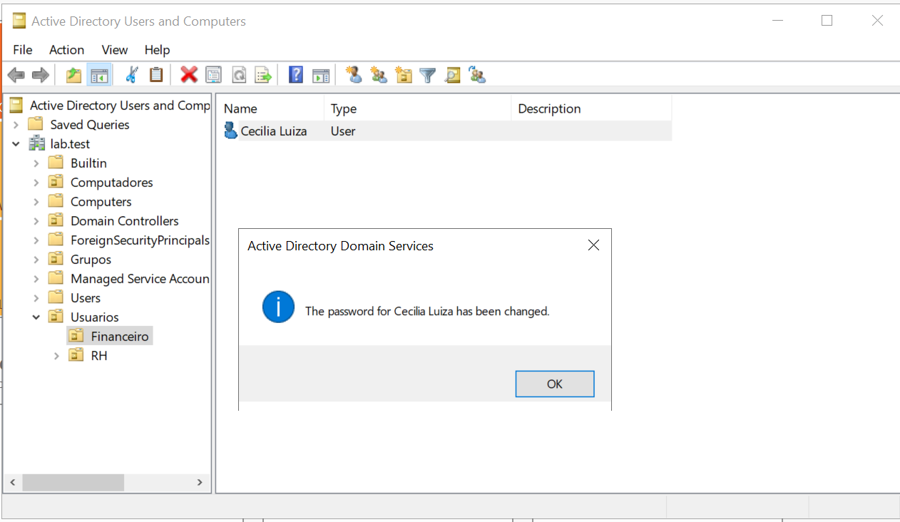

## 9. Troca obrigatória no primeiro logon

Após a redefinição, o Windows exigiu que a usuária definisse uma nova senha antes de concluir o acesso.

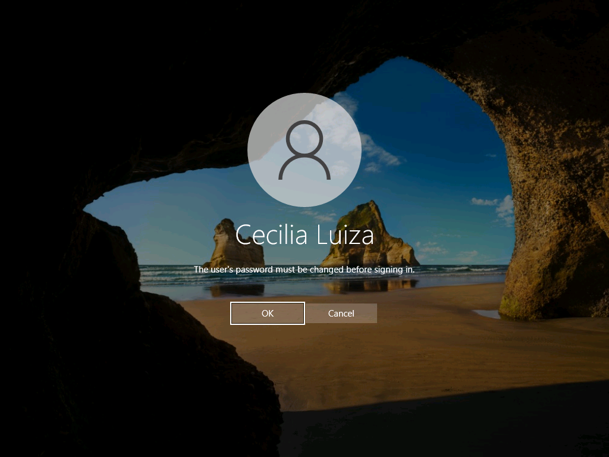

## 10. Política de bloqueio de conta

Para possibilitar a simulação do laboratório, foi configurada uma política de bloqueio após três tentativas inválidas de autenticação, com duração e redefinição do contador em 30 minutos.

> Esta configuração foi utilizada apenas para fins de demonstração no laboratório e não representa uma recomendação universal para ambientes de produção.

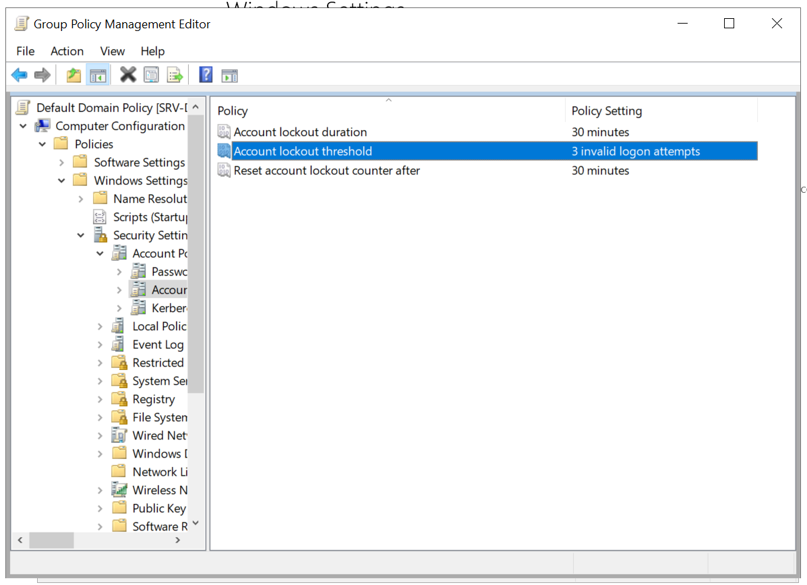

## 11. Validação do bloqueio de conta

Após tentativas consecutivas com senha incorreta, a conta da usuária foi bloqueada conforme a política aplicada.

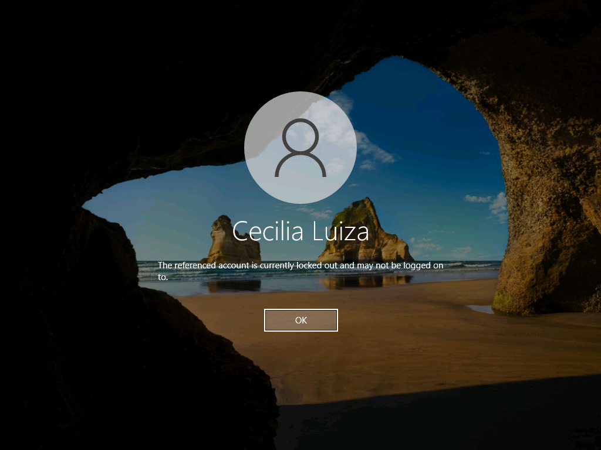

## 12. Desbloqueio de conta no AD

A conta bloqueada foi identificada nas propriedades do usuário e desbloqueada através do Active Directory Users and Computers.

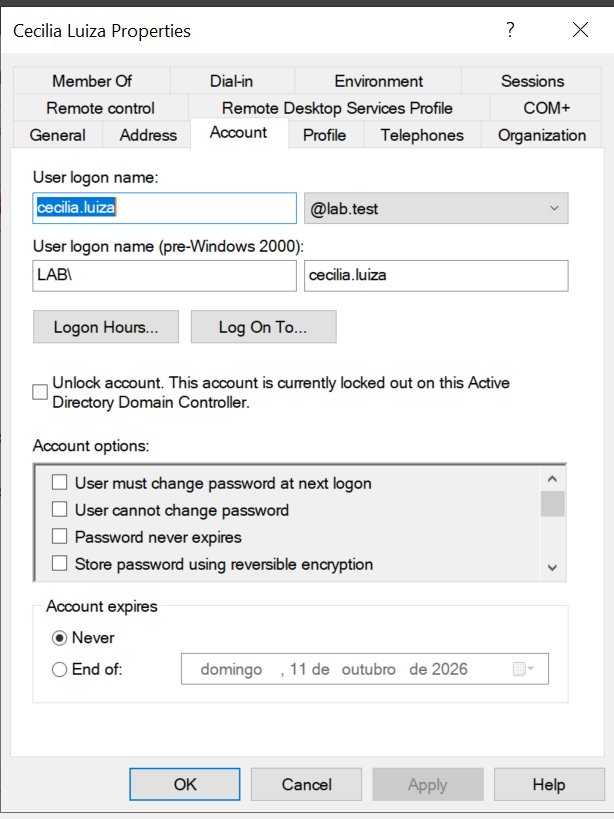

## 13. Conta desabilitada

Também foi validado o comportamento de uma conta desabilitada no Active Directory. A tentativa de autenticação na estação foi corretamente negada.

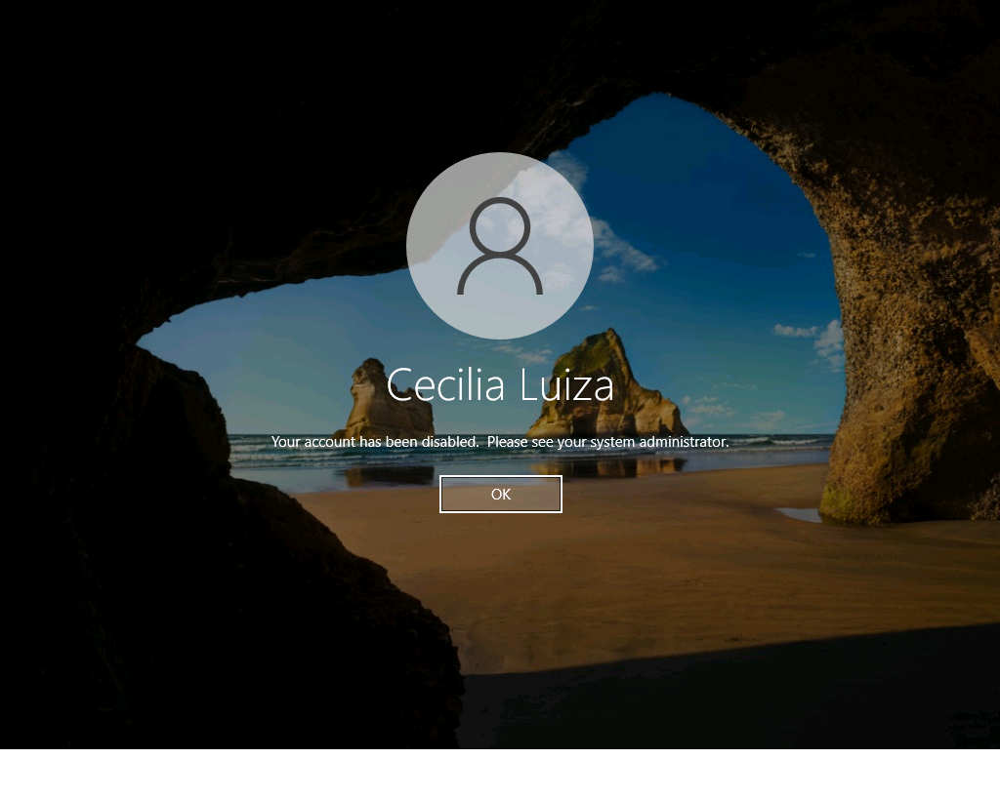

# 👤 Onboarding de novo colaborador

## 14. Criação do usuário

Foi simulada a admissão de Rafael Martins no setor Financeiro, com criação da conta dentro da OU correspondente.

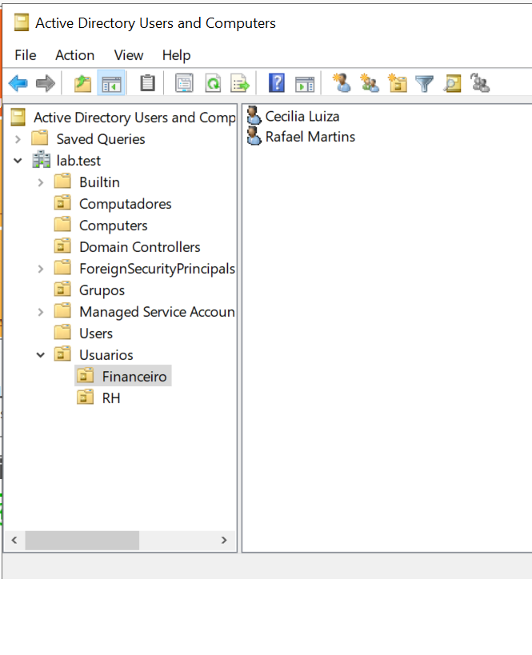

## 15. Concessão de acesso por grupo

Rafael Martins foi adicionado ao grupo `GG_Financeiro`, recebendo as permissões vinculadas ao grupo em vez de permissões concedidas diretamente à conta.

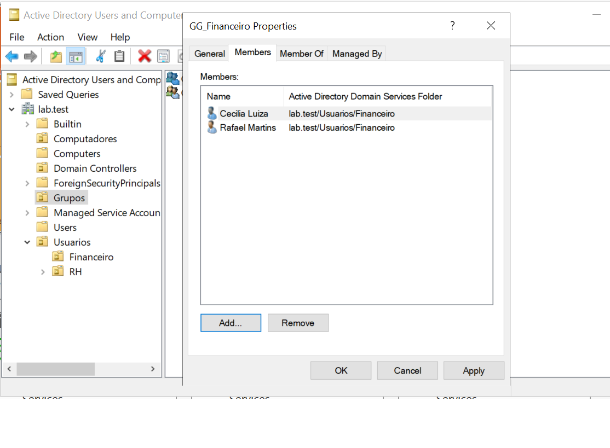

## 16. Validação do onboarding

Após o primeiro acesso, o novo usuário conseguiu utilizar o compartilhamento e criar o arquivo `Teste_Rafael`, confirmando que as permissões foram aplicadas corretamente.

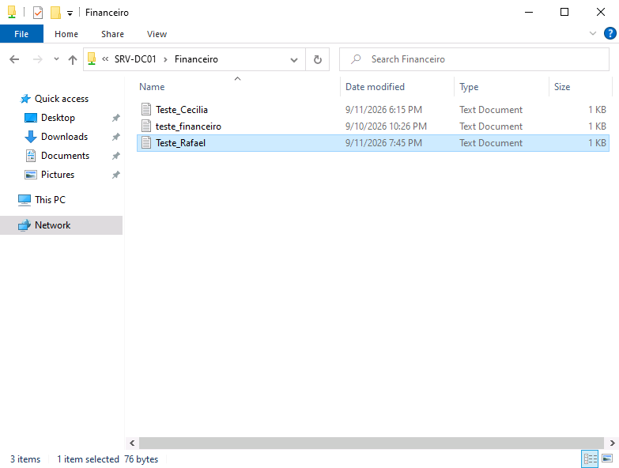

# 🛡️ Princípio do menor privilégio

## 17. Acesso negado para usuário não autorizado

Foi realizado um teste com uma conta sem associação ao `GG_Financeiro`. Ao tentar acessar o compartilhamento do setor, o Windows retornou acesso negado, validando que somente usuários autorizados possuem acesso ao recurso.

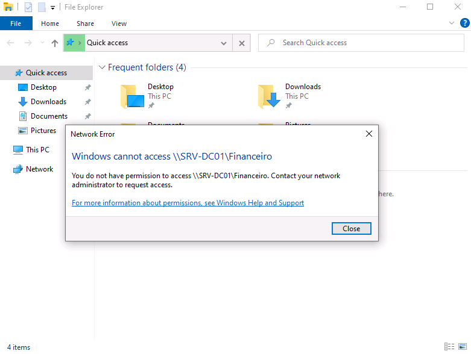

# 💡 Competências praticadas

- Active Directory Domain Services (AD DS)
- Active Directory Users and Computers (ADUC)
- Criação e organização de usuários e OUs
- Grupos de segurança
- Gerenciamento de permissões NTFS
- Compartilhamento de arquivos em rede
- Reset e troca de senha
- Bloqueio e desbloqueio de contas
- Habilitação e desabilitação de usuários
- Onboarding e gestão de acessos
- Princípio do menor privilégio
- Troubleshooting de autenticação e permissões
- Documentação técnica de atendimentos
- Rotinas de Suporte Técnico N1

## ✅ Resultado

O laboratório permitiu aplicar de forma prática atividades recorrentes de suporte em ambientes com Active Directory, desde a criação e organização das contas até a concessão, validação e revogação de acessos.

Além da execução dos procedimentos técnicos, cada cenário foi validado na estação cliente e documentado com foco em clareza, rastreabilidade e continuidade do atendimento.